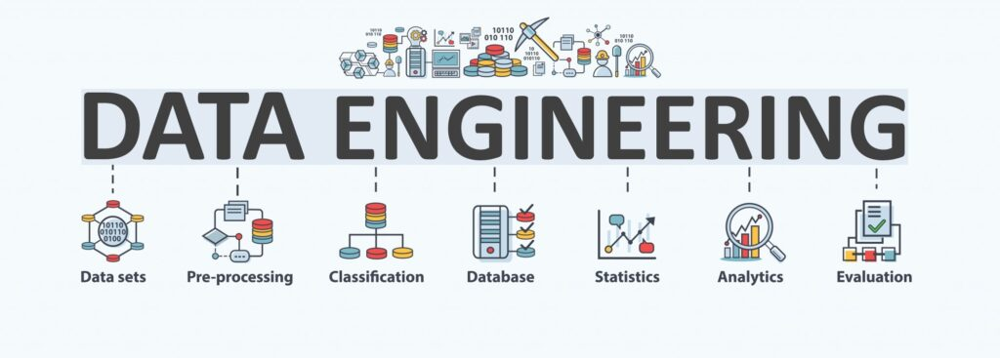

    

## Entregas de la cursada

Este curso está dividido en varias entregas hasta el proyecto final, en los siguientes numerales encontrarás el enlace para ir a cada entrega:

1. [Entrega 1](https://github.com/Ivan2125/data-eng-coderhouse/tree/main/1-entrega) - Script que extrae datos de una API pública y crear la tabla en Redshift para posterior carga de sus datos.
2. [Entrega 2](/D:/Ivan2125/data-eng-coderhouse/deliverables/deliverable2) - En proceso.
3. [Entrega 3](/D:/Ivan2125/data-eng-coderhouse/deliverables/deliverable3) - En proceso.
4. [Entrega 4](/D:/Ivan2125/data-eng-coderhouse/deliverables/deliverable4) - En proceso.
5. [Entrega 5](/D:/Ivan2125/data-eng-coderhouse/deliverables/deliverable5) - En proceso.
